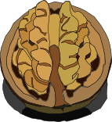

# List of science divulgation Youtube channels
The information was always published in written documents, but today is more easy to know about something with a Youtube video.

+ **N**: Not
+ **U**: Understanding
+ **T**: This

A nut has a hard shell. But one time this is open, inside it is one of the most delicious meals. Let's crack the hull of doubts and don't break yout head.

### [*English channels list*](./english.md)

# Lista de canales de Youtube de divulgación científica
La información ha sido siempre publicada en documento escritos, pero hoy en díá es más fácil llegar a conocer sobre algo con un video de Youtube.

Una nuez (Nut) tiene una cáscara dura. Pero una vez abierta, adentro se encuentra uno de los alimentos más deliciosos. Vamos a romper la cáscara de las dudas y no te rompas la cabeza.

### [*Lista de canales en español*](./spanish.md)

